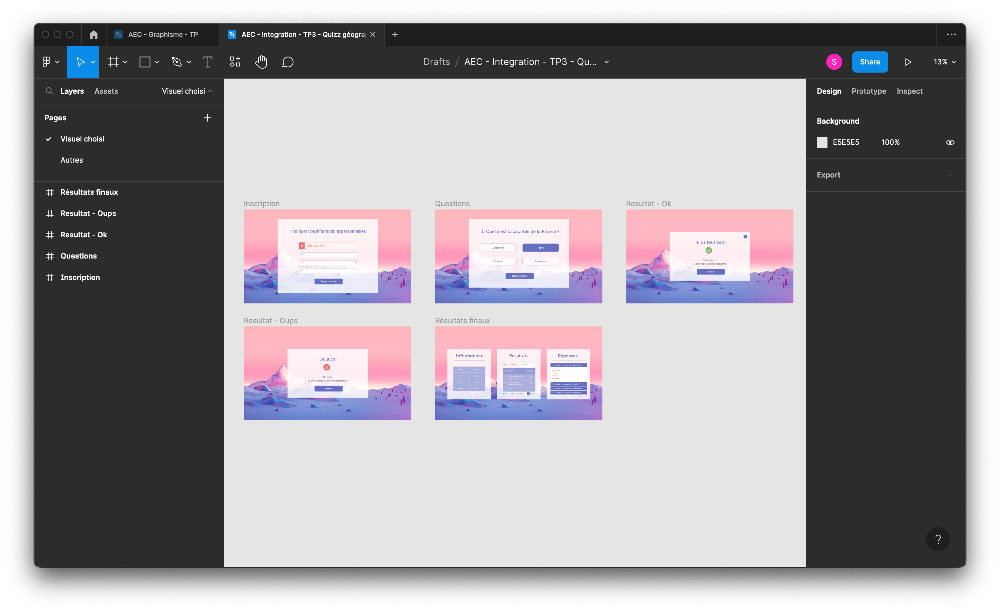

# Description 

Projet réalisé dans le cadre de mon AEC en développement web. 

L’objectif du travail était de créer un petit quiz en utilisant du JQuery et Bootstrap 4 en respectant certains critères comme d'utiliser des transitions entre les questions, etc. Une fois le petit quiz terminé, les résultats devaient s'afficher sous forme de tableau. 

## Table des matières

1. [Visuels](#visuels)
2. [Prototype Figma](#prototype-figma)
3. [Démonstration du projet](#démonstration-du-projet)

# Visuels

# Prototype Figma 

[Consulter le prototype Figma du projet](https://www.figma.com/proto/Iaj1H8atOTIlEln82p5vUM/AEC---Integration---TP3---Quizz-g%C3%A9ographie?page-id=0%3A1&node-id=4%3A668&viewport=-202%2C261%2C0.13&scaling=contain)

# Démonstration du projet 

[Consulter le projet sur mon site web personnel](https://shweeby.ca/portfolio/projets/aec-sess2-integ-projet1/)